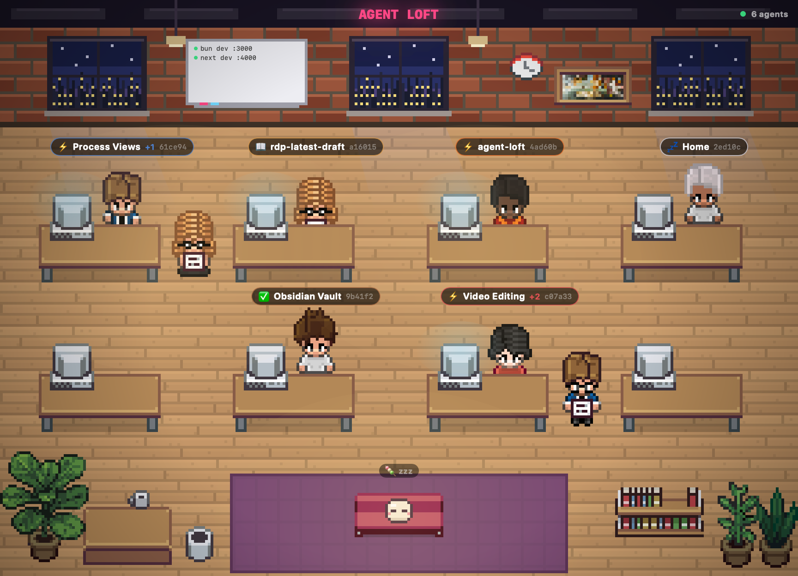

# Agent Loft

A pixel-art macOS app that shows every running Claude Code agent as an animated character in a startup loft.



## What it does

- Detects Claude Code sessions (CLI, Desktop, web) by reading the session files in `~/.claude/projects/`
- Gives each agent its own pixel character at a desk in the loft
- Animates characters by activity: typing while working, reading while reading files, sitting still when idle or done
- Shows the first subagent as an "intern" standing next to its parent's desk; the name tag shows how many there are
- Click an agent to see what it's working on, its working directory and status
- Shows the agent count in the top bar, plus per-project counts (e.g. "RDP 2 · Video Editing 1") when there are three projects or fewer
- Lists running dev servers (bun dev, next dev, …) on the whiteboard

## Tech

- Single-file SwiftUI app
- Top-down pixel art on a 16 px grid (288 × 208), scaled 3× and drawn with `Canvas` and `TimelineView`
- Characters and furniture are PNG sprites in `assets/` (see [assets/CREDITS.md](assets/CREDITS.md)); the brick wall, night windows, whiteboard, lights and Mochi are drawn in code
- Characters type while working, read while reading, and sit still when idle or done
- Native file I/O with `FileHandle` and `FileManager`
- Reads the last 80 KB of each session file and uses its `cwd` for project names
- Refreshes every 5 seconds in the background

## Build

```bash
./build.sh
```

This compiles the app and, if `~/Applications/Agent Loft.app` exists, installs the binary and sprites into it. Otherwise run `./build/AgentLoft`.

To render the loft with demo agents to an image (used for the screenshot above):

```bash
./build/AgentLoft --snapshot docs/screenshot.png
```

## History

The source was not kept in git while I built it. The first two commits mark real work days (7 and 12 May 2026) using the dates of the built app, my project note and a debug log; the source commit is dated when the file was last saved.
